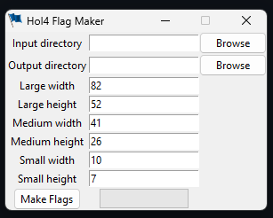

# HoI4 flag maker
[Hearts of Iron IV](https://en.wikipedia.org/wiki/Hearts_of_Iron_IV) is a grand strategy computer wargame with a large 
modding community.

**HoI4 flag maker** is a tool to generate [tga](https://en.wikipedia.org/wiki/Truevision_TGA) files from a png file 
for use in mods.

HoI4 requires 3 tga files for each flag added to the game. A large, medium, and small saved in your mod like so:
- YOURMOD/gfx/flags/flag.tga
- YOURMOD/gfx/flags/medium/flag.tga
- YOURMOD/gfx/flags/small/flag.tga

The tga file format for all is 32-bits and uncompressed

Large size: 82x52 pixel

Medium size: 41x26 pixel

Small size: 10x7 pixel

## Setup

### Prerequisites
- [Python](https://www.python.org/) 3.11.1
- [Pillow](https://github.com/python-pillow/Pillow) 10.1.0
- [pyTGA](https://github.com/MircoT/pyTGA) 1.1.0

### Getting Started
```shell
# clone this repo
git clone https://github.com/atthematyo/hoi4_flag_maker.git
cd hoi4_flag_maker
# Run script
python flags.py
# Run GUI
python gui.py
```

#### flags.py
The first time you run flags.py it will make an input directory for you. This is where you will put all the png files 
you want to convert to tga files. Once you have png files to convert, the script will make an output directory where it 
will store your png files. You can then drag the contents of output to your mod's gfx/flags directory.

#### gui.py


There is also a simple tkinter GUI.

In the GUI you pick any directory as input and any as output.

There is also a binary exe of the GUI you can you use if you don't want to figure out Python or the dependencies.
This is made with pyinstaller.

Download the zip [here](https://github.com/atthematyo/hoi4_flag_maker/releases)

Unzip where ever you want to install it then run the exe to run the GUI.

### Example
You have a cool flag that you want to use in your mod. 
[The Grand Union Flag](https://en.wikipedia.org/wiki/Grand_Union_Flag) would make a good neutral USA flag.

Start by downloading the png and putting it in the input directory with the correct name for what you are using it for. 
In this case USA_neutrality so that it shows up only for the USA when it is neutral.


Next either run the flags script or use the GUI.

Now that we have run it we have this in the output directory.


Drag all of that to YOURMOD/gfx/flags

Running the mod we see


